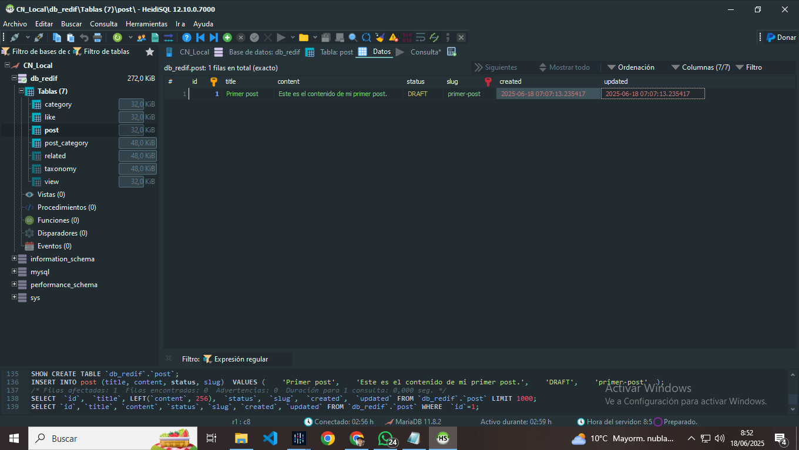

# TypeORM Decorators Reference

Este archivo documenta los decoradores de TypeORM usados en el proyecto, con enlaces a la documentación oficial y una explicación de por qué y cómo se usan en este contexto.

---

## @Entity()

- **Documentación oficial:**  
  https://typeorm.io/decorator-reference#entity
- **¿Qué hace?**  
  Marca la clase como una entidad de base de datos (crea una tabla).
- **¿Por qué lo uso?**  
  Porque quiero que esta clase se convierta en una tabla en la base de datos y que sus propiedades sean columnas.

---

## @PrimaryGeneratedColumn()

- **Documentación oficial:**  
  https://typeorm.io/decorator-reference#primarygeneratedcolumn
- **¿Qué hace?**  
  Define una columna como clave primaria y la genera automáticamente (auto-incremental).
- **¿Por qué lo uso?**  
  Para que cada registro tenga un identificador único generado automáticamente por la base de datos, facilitando la referencia y relaciones entre tablas.

---

## @Column()

- **Documentación oficial:**  
  https://typeorm.io/decorator-reference#column
- **¿Qué hace?**  
  Define una columna normal en la tabla.
- **¿Por qué lo uso?**  
  Para mapear las propiedades de la clase a columnas de la tabla y poder definir el tipo de dato, restricciones y opciones de cada campo.

---

## @CreateDateColumn()

- **Documentación oficial:**  
  https://typeorm.io/decorator-reference#createdatecolumn
- **¿Qué hace?**  
  Crea una columna que almacena la fecha de creación del registro, asignada automáticamente.
- **¿Por qué lo uso?**  
  Para llevar un control automático de cuándo se creó cada registro, útil para auditoría, ordenamiento o mostrar información temporal al usuario.

---

## @UpdateDateColumn()

- **Documentación oficial:**  
  https://typeorm.io/decorator-reference#updatedatecolumn
- **¿Qué hace?**  
  Crea una columna que almacena la fecha de la última actualización del registro, asignada automáticamente.
- **¿Por qué lo uso?**  
  Para saber cuándo fue la última vez que se modificó un registro, lo que ayuda en auditoría, sincronización y control de cambios.

---

## @ManyToMany()

- **Documentación oficial:**  
  https://typeorm.io/decorator-reference#manytomany
- **¿Qué hace?**  
  Define una relación muchos a muchos entre dos entidades.
- **¿Por qué lo uso?**  
  Porque necesito que una entidad pueda estar relacionada con muchas de otra entidad y viceversa, como en el caso de posts y categorías.

---

## @JoinTable()

- **Documentación oficial:**  
  https://typeorm.io/decorator-reference#jointable
- **¿Qué hace?**  
  Indica que esta parte de la relación muchos a muchos es la que crea la tabla intermedia (pivot).
- **¿Por qué lo uso?**  
  Para que TypeORM cree automáticamente la tabla pivot que relaciona ambas entidades y así poder gestionar la relación muchos a muchos de forma sencilla.

---

## @ManyToOne()

- **Documentación oficial:**  
  https://typeorm.io/decorator-reference#manytoone
- **¿Qué hace?**  
  Define una relación muchos a uno (muchos registros de esta entidad pueden estar relacionados con uno de la otra).
- **¿Por qué lo uso?**  
  Porque necesito que varios registros de una entidad estén asociados a un solo registro de otra entidad, como varios likes asociados a un solo post.

---

## @OneToMany()

- **Documentación oficial:**  
  https://typeorm.io/decorator-reference#onetomany
- **¿Qué hace?**  
  Define una relación uno a muchos (un registro de esta entidad puede estar relacionado con muchos de la otra).
- **¿Por qué lo uso?**  
  Para poder acceder desde una entidad a todos los registros relacionados de otra entidad, por ejemplo, ver todos los likes de un post.

---

## @JoinColumn()

- **Documentación oficial:**  
  https://typeorm.io/decorator-reference#joincolumn
- **¿Qué hace?**  
  Especifica la columna que se usará para la relación en la base de datos (usado en relaciones @ManyToOne y @OneToOne).
- **¿Por qué lo uso?**  
  Para personalizar el nombre de la columna de la clave foránea y definir explícitamente cómo se unen las tablas en la relación.

---

## Consultas

- **Category.entity**  
  Info y content, si podrias recordarme en el ejemplo visual, cual seria cada uno.
- **Like.entity.ts**  
  Explicarme bien la logica, lo que entiendo es cuando el usuario clickea en el boton de que el contenido le resulto util (like), se ejecuta un post que crea un registro en la base de datos en la tabla "like", el registro tiene el ID (autogenerado), el post_id que lo puse como "post" en la entidad y el likes, no entiendo el proposito del likes.
  Yo pensaria que ese campo estaria de mas porque al likear y relacionar el like con el post pertinente, ya el post generaria en sus atributos el campo likes, que seria basicamente un array de likes, eliminando la necesidad de un campo redundante.
- **Post.entity**  
  Si quisieras que desde el back se de formato al Date que genera la etiqueta @CreateDateColumn(), o se haria directamente en el front con pipes en caso de querer mostrar este dato.
  Si quisieras que desde el back se de formato al Date que genera la etiqueta @UpdateDateColumn(), o se haria directamente en el front con pipes en caso de querer mostrar este dato.
- **Related.entity**  
  Si podrias explicarme de nuevo el proposito de su creacion.
- **Taxonomy.entity**  
  Si podrias explicarme de nuevo el proposito de este registro.  
- **View.entity**  
  Al igual que en Like.entity considero el propósito del campo "views" redundante, ya que la relación con el contenido debería ser suficiente para determinar las visualizaciones.

---

## Imagen Visual

  
---
